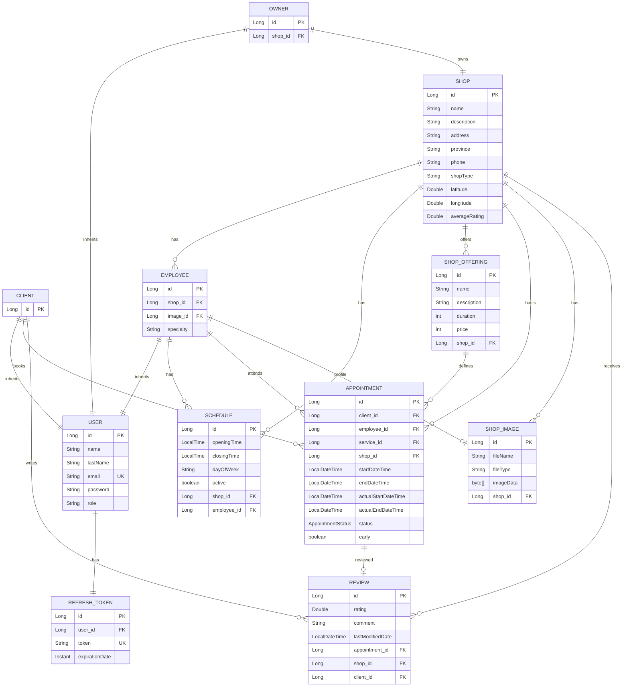

<p align="center">
  <h1 align="center">💈 TuTurno — Appointment Management System</h1>
  <p align="center">
    <strong>RESTful API for appointment management in service-based businesses</strong>
  </p>
</p>

<p align="center">
  
  
  
  
  
  
  
</p>

---

## 📋 Table of Contents

- [Overview](#-overview)
- [Tech Stack](#-tech-stack)
- [Key Features](#-key-features)
- [Architecture](#-architecture)
- [Data Model](#-data-model)
- [API Documentation](#-api-documentation)
- [Installation & Setup](#-installation--setup)
- [Environment Variables](#-environment-variables)
- [Running the Project](#-running-the-project)
- [Project Structure](#-project-structure)
- [Author](#-author)

---

## 🎯 Overview

**TuTurno** is a backend system designed to solve the core operational challenge faced by service-based businesses (hair salons, barbershops): **efficient appointment and booking management**.

The platform enables a multi-role ecosystem where:

- **Owners** create and manage their shop, define services, register employees, configure schedules, and upload shop images.
- **Employees** manage their personal schedules, confirm/cancel appointments, register walk-in appointments, and check their earnings.
- **Clients** explore available shops through paginated search with filters, check real-time availability, book appointments, leave reviews, and manage their profile.

The system automates appointment lifecycle transitions, sends email reminders via scheduled tasks, and enforces strict role-based access control.

---

## 🛠 Tech Stack

| Category | Technology | Version |
|---|---|---|
| **Language** | Java (OpenJDK) | 21 |
| **Framework** | Spring Boot | 3.5.9 |
| **Persistence** | Spring Data JPA / Hibernate | — |
| **Database** | PostgreSQL | Runtime |
| **Security** | Spring Security + JWT (`jjwt`) | 0.11.5 |
| **Validation** | Jakarta Bean Validation | — |
| **Email** | Spring Boot Starter Mail | — |
| **API Documentation** | SpringDoc OpenAPI (Swagger UI) | 2.8.14 |
| **Build Tool** | Apache Maven | Wrapper included |
| **Development Tools** | Spring Boot DevTools (hot reload) | — |

---

## ✨ Key Features

### 🔐 Authentication & Authorization
- User registration with differentiated roles: `CLIENT`, `OWNER`, `EMPLOYEE`
- Stateless authentication via **JWT** stored in **HttpOnly Cookies** (access token + refresh token)
- Token renewal mechanism without re-login
- Password encryption with **BCrypt**
- Endpoint protection by role through Spring Security's filter chain

### 🏢 Shop Management (Owner)
- Full CRUD for shop information (name, description, address, province, phone, type, geolocation)
- Image gallery management with binary storage (BYTEA), support for bulk upload and partial editing
- Average rating calculation derived from client reviews

### 👥 Employee Management (Owner)
- CRUD with profile image upload (`multipart/form-data`)
- Employee-shop association with specialty field
- Individual schedule management per employee

### 🕐 Schedule Management
- Dual scope: schedules at **shop** level and at **employee** level
- Configuration by day of the week (Monday to Sunday)
- Opening/closing times with active/inactive toggle
- Full CRUD operations for each scope

### ✂️ Service Catalog
- CRUD for offered services (name, description, price, duration in minutes)
- Service-shop association guaranteed at persistence level

### 📅 Appointment Booking Engine
- **Real-time availability calculation** via `AvailabilityCalculatorService`:
  - Crosses employee schedule with existing active appointments
  - Generates available time slots in 15-minute intervals based on service duration
  - Filters past slots and overlapping bookings
- **Overlap detection** via JPQL queries to prevent double booking
- **Business validation**: employee-service-shop consistency verification
- Clients are limited to one active appointment at a time
- Employees can create walk-in appointment records (anonymous client)

### 🔄 Appointment Lifecycle
- State machine: `PENDING` → `CONFIRMED` → `COMPLETED` / `CANCELLED`
- **Automatic state transitions** via `@Scheduled` tasks (every 10 minutes)
- Both clients and employees can cancel appointments
- Employees confirm pending appointments (triggers confirmation email)

### 📧 Email Notifications
- **Asynchronous** email delivery (`@Async`)
- Confirmation email sent upon appointment approval
- **Daily reminders** at 8:00 AM for the day's confirmed appointments
- Anonymous client email filtering

### ⭐ Reviews & Ratings
- Clients publish reviews (rating 0–5 + comment) linked to the shop and appointment
- One review per client per shop (`UNIQUE` constraint at database level)
- Public endpoints to list reviews and get average rating

### 📊 Employee Statistics
- Earnings calculation by date range based on completed appointments

### 🔍 Public Discovery
- Paginated shop search with optional filters: type, province, name
- Public access to shop details, images, and reviews (no authentication required)

### 🛡️ Error Handling
- Centralized exception handling via `@RestControllerAdvice`
- Custom exceptions: `EmailAlreadyExistsException`, `InvalidCredentialsException`
- Structured JSON error responses with appropriate HTTP status codes

---

## 🏛 Architecture

The project follows a **Layered (N-Tier) Architecture** pattern with clear separation of concerns:

```
┌──────────────────────────────────────────────────────────┐
│                    CLIENT (Frontend)                      │
└──────────────────────┬───────────────────────────────────┘
                       │ HTTP (REST + Cookies)
┌──────────────────────▼───────────────────────────────────┐
│             🔒 Security Filter Chain                     │
│        JwtAuthenticationFilter → UserPrincipal           │
└──────────────────────┬───────────────────────────────────┘
                       │
┌──────────────────────▼───────────────────────────────────┐
│              📡 Controllers (REST API)                   │
│ AuthController · ClientAppointmentController · ShopCtrl…  │
│                 ↕ DTOs for data transfer                 │
└──────────────────────┬───────────────────────────────────┘
                       │
┌──────────────────────▼───────────────────────────────────┐
│             ⚙️ Services (Business Logic)                │
│ AppointmentServiceImpl · AvailabilityCalculatorService    │
│ AuthService · EmailServiceImpl · AppointmentTaskScheduler │
└──────────────────────┬───────────────────────────────────┘
                       │
┌──────────────────────▼───────────────────────────────────┐
│            💾 Repositories (Data Access)                 │
│      Spring Data JPA + Custom JPQL Queries               │
└──────────────────────┬───────────────────────────────────┘
                       │
┌──────────────────────▼───────────────────────────────────┐
│                🗄️ PostgreSQL Database                    │
└──────────────────────────────────────────────────────────┘
```

**Data flow:** Client → Security Filter → Controller → Service → Repository → Database

**Cross-cutting concerns:**
- **Validation:** Jakarta Bean Validation annotations on entities and DTOs
- **Exception handling:** `GlobalExceptionHandler` with `@RestControllerAdvice`
- **Scheduled tasks:** `AppointmentTaskScheduler` for automatic state transitions and reminder delivery
- **Asynchronous processing:** `@Async` for non-blocking email delivery

---

## 📊 Data Model

### Entity-Relationship Diagram



### Inheritance Strategy
The `User` entity uses **JPA Joined Table inheritance** (`@Inheritance(strategy = InheritanceType.JOINED)`), creating separate tables for `Client`, `Owner`, and `Employee` that join with the `app_user` table.

### Appointment Statuses

| Status | Description |
|---|---|
| `PENDING` | Booked by the client, awaiting employee confirmation |
| `CONFIRMED` | Confirmed by the employee — triggers confirmation email |
| `IN_PROGRESS` | The appointment is currently underway |
| `COMPLETED` | Automatically set when the end time has passed (scheduled task) |
| `CANCELLED` | Cancelled by the client or the employee |

---

## 📡 API Documentation

> 📖 **Interactive documentation available at** `http://localhost:8080/swagger-ui.html` when the server is running.

### 🔓 Authentication (`/auth`)

| Method | Endpoint | Description | Auth |
|---|---|---|---|
| `POST` | `/auth/client` | Register a new client | 🌐 Public |
| `POST` | `/auth/owner` | Register a new business owner | 🌐 Public |
| `POST` | `/auth/login` | Log in — sets HttpOnly cookies | 🌐 Public |
| `POST` | `/auth/refresh` | Renew access token via cookie | 🔑 Cookie |

### 🌐 Public (`/public/shops`)

| Method | Endpoint | Description | Auth |
|---|---|---|---|
| `GET` | `/public/shops` | Search shops (paginated, with filters) | 🌐 Public |
| `GET` | `/public/shops/{id}` | Get shop details by ID | 🌐 Public |
| `GET` | `/public/shops/images/{id}` | Download shop image (binary) | 🌐 Public |
| `GET` | `/public/shops/{shopId}/reviews` | List reviews for a shop | 🌐 Public |
| `GET` | `/public/shops/{shopId}/reviews/average` | Get average rating | 🌐 Public |

### 👤 Client (`/client`)

| Method | Endpoint | Description | Auth |
|---|---|---|---|
| `GET` | `/client/profile` | Get current client profile | 🔐 CLIENT |
| `PUT` | `/client/profile` | Update client profile | 🔐 CLIENT |
| `DELETE` | `/client/profile` | Delete client account | 🔐 CLIENT |
| `POST` | `/client/appointments` | Book an appointment | 🔐 CLIENT |
| `GET` | `/client/appointments/availability` | Check slot availability | 🌐 Public |
| `GET` | `/client/appointments/active` | List active appointments | 🔐 CLIENT |
| `GET` | `/client/appointments/history` | Appointment history | 🔐 CLIENT |
| `PATCH` | `/client/appointments/{appointmentId}/cancel` | Cancel an appointment | 🔐 CLIENT |
| `POST` | `/client/reviews` | Publish a review | 🔐 CLIENT |

### 🏢 Business Owner (`/owner`)

| Method | Endpoint | Description | Auth |
|---|---|---|---|
| `POST` | `/owner/shop` | Create shop | 🔐 OWNER |
| `GET` | `/owner/shop` | Get own shop | 🔐 OWNER |
| `PUT` | `/owner/shop` | Update shop | 🔐 OWNER |
| `GET` | `/owner/shop/{id}` | Get shop by ID | 🔐 OWNER |
| `POST` | `/owner/employees` | Create employee (multipart) | 🔐 OWNER |
| `GET` | `/owner/employees` | List employees | 🔐 OWNER |
| `GET` | `/owner/employees/{employeeId}` | Get employee by ID | 🔐 OWNER |
| `PUT` | `/owner/employees/{employeeId}` | Update employee (multipart) | 🔐 OWNER |
| `DELETE` | `/owner/employees/{employeeId}` | Delete employee | 🔐 OWNER |
| `POST` | `/owner/services` | Create service | 🔐 OWNER |
| `GET` | `/owner/services` | List services | 🔐 OWNER |
| `GET` | `/owner/services/{id}` | Get service by ID | 🔐 OWNER |
| `PUT` | `/owner/services/{id}` | Update service | 🔐 OWNER |
| `DELETE` | `/owner/services/{id}` | Delete service | 🔐 OWNER |
| `POST` | `/owner/schedules` | Create shop schedule | 🔐 OWNER |
| `GET` | `/owner/schedules` | List shop schedules | 🔐 OWNER |
| `GET` | `/owner/schedules/{id}` | Get schedule by ID | 🔐 OWNER |
| `PUT` | `/owner/schedules/{id}` | Update shop schedule | 🔐 OWNER |
| `DELETE` | `/owner/schedules/{id}` | Delete shop schedule | 🔐 OWNER |
| `POST` | `/owner/shop/images` | Upload shop images (multipart) | 🔐 OWNER |
| `GET` | `/owner/shop/images` | List shop images | 🔐 OWNER |
| `PATCH` | `/owner/shop/images` | Partial edit (add/remove images) | 🔐 OWNER |
| `GET` | `/owner/shop/images/{imageId}/file` | Download image file | 🌐 Public |

### 👨‍💼 Employee (`/employee`)

| Method | Endpoint | Description | Auth |
|---|---|---|---|
| `POST` | `/employee/agenda` | Create walk-in appointment (no prior booking) | 🔐 EMPLOYEE |
| `GET` | `/employee/agenda/availability` | Check own availability | 🔐 EMPLOYEE |
| `GET` | `/employee/agenda/my-services` | List available services | 🔐 EMPLOYEE |
| `GET` | `/employee/appointments/confirmed` | List confirmed appointments | 🔐 EMPLOYEE |
| `GET` | `/employee/appointments/pending` | List pending appointments | 🔐 EMPLOYEE |
| `GET` | `/employee/appointments/history` | Appointment history | 🔐 EMPLOYEE |
| `PATCH` | `/employee/appointments/{appointmentId}/confirm` | Confirm appointment → sends email | 🔐 EMPLOYEE |
| `PATCH` | `/employee/appointments/{appointmentId}/cancel` | Cancel appointment | 🔐 EMPLOYEE |
| `POST` | `/employee/schedules` | Create own schedule | 🔐 EMPLOYEE |
| `GET` | `/employee/schedules` | List own schedules | 🔐 EMPLOYEE |
| `GET` | `/employee/schedules/{id}` | Get schedule by ID | 🔐 EMPLOYEE |
| `PUT` | `/employee/schedules/{id}` | Update own schedule | 🔐 EMPLOYEE |
| `DELETE` | `/employee/schedules/{id}` | Delete own schedule | 🔐 EMPLOYEE |
| `GET` | `/employee/stats/earnings` | Earnings by date range | 🔐 EMPLOYEE |

---

## 🚀 Installation & Setup

### Prerequisites

- **Java 21** (JDK)
- **PostgreSQL** 14+ (running instance)
- **Maven 3.8+** (or use the included `mvnw` wrapper)
- **SMTP Credentials** (Gmail App Password recommended for email features)

### 1. Clone the Repository

```bash
git clone https://github.com/<your-username>/sistematunos-back.git
cd sistematunos-back
```

### 2. Configure the Database

Create a PostgreSQL database:

```sql
CREATE DATABASE tuturno_db;
```

### 3. Configure `application.properties`

Create or update the file `src/main/resources/application.properties`:

```properties
# ── Server ──────────────────────────────────────────────
server.port=8080

# ── Database ────────────────────────────────────────────
spring.datasource.url=jdbc:postgresql://localhost:5432/tuturno_db
spring.datasource.username=your_db_username
spring.datasource.password=your_db_password

# ── JPA / Hibernate ────────────────────────────────────
spring.jpa.hibernate.ddl-auto=update
spring.jpa.show-sql=true
spring.jpa.properties.hibernate.dialect=org.hibernate.dialect.PostgreSQLDialect

# ── JWT ─────────────────────────────────────────────────
jwt.secret=your_base64_secret_key_minimum_256_bits
jwt.expiration=900000

# ── Refresh Token ───────────────────────────────────────
refresh.token.duration=604800000

# ── Email (SMTP) ────────────────────────────────────────
spring.mail.host=smtp.gmail.com
spring.mail.port=587
spring.mail.username=your_email@gmail.com
spring.mail.password=your_app_password
spring.mail.properties.mail.smtp.auth=true
spring.mail.properties.mail.smtp.starttls.enable=true

# ── File Upload ─────────────────────────────────────────
spring.servlet.multipart.max-file-size=5MB
spring.servlet.multipart.max-request-size=20MB
```

---

## ▶️ Running the Project

### Using Maven Wrapper (recommended)

```bash
# Linux / macOS
./mvnw spring-boot:run

# Windows
mvnw.cmd spring-boot:run
```

### Using global Maven

```bash
mvn spring-boot:run
```

### Build an executable JAR

```bash
./mvnw clean package -DskipTests
java -jar target/sistematunos-back-0.0.1-SNAPSHOT.jar
```

The server will start at `http://localhost:8080`.

**Swagger UI:** [`http://localhost:8080/swagger-ui.html`](http://localhost:8080/swagger-ui.html)

---

## 📁 Project Structure

```
sistematunos-back/
├── src/
│   ├── main/
│   │   ├── java/com/gaston/sistema/turno/sistematunos_back/
│   │   │   ├── SistematunosBackApplication.java       # Entry point (@EnableScheduling, @EnableAsync)
│   │   │   ├── configuration/
│   │   │   │   └── OpenApiConfig.java                 # Swagger/OpenAPI configuration
│   │   │   ├── controllers/                           # 14 REST controllers
│   │   │   │   ├── AuthController.java                # Registration & login
│   │   │   │   ├── ClientAppointmentController.java   # Client appointment operations
│   │   │   │   ├── EmployeeAppointmentController.java # Employee appointment management
│   │   │   │   ├── EmployeeAgendaController.java      # Employee agenda & walk-ins
│   │   │   │   ├── ShopController.java                # Shop CRUD (owner)
│   │   │   │   ├── EmployeeController.java            # Employee CRUD (owner)
│   │   │   │   ├── ShopOfferingController.java        # Service CRUD (owner)
│   │   │   │   ├── ShopScheduleController.java        # Shop schedules (owner)
│   │   │   │   ├── EmployeeScheduleController.java    # Employee schedules
│   │   │   │   ├── ShopImageController.java           # Image management (owner)
│   │   │   │   ├── PublicShopController.java          # Public shop discovery
│   │   │   │   ├── ClientController.java              # Client profile
│   │   │   │   ├── ReviewController.java              # Reviews
│   │   │   │   └── EmployeeStatsController.java       # Employee statistics
│   │   │   ├── dto/                                   # 15 Data Transfer Objects
│   │   │   ├── entities/                              # 13 JPA Entities + Enums
│   │   │   ├── repositories/                          # 11 Spring Data Repositories
│   │   │   ├── security/                              # JWT Filter, config, UserPrincipal
│   │   │   ├── services/                              # 26 service files (interfaces + impl)
│   │   │   └── validation/                            # Custom exceptions + GlobalExceptionHandler
│   │   └── resources/
│   │       └── application.properties                 # Configuration (in .gitignore)
│   └── test/                                          # Unit tests
├── pom.xml                                            # Maven dependencies
├── mvnw / mvnw.cmd                                    # Maven Wrapper
└── README.md
```

---

## 👤 Author

**Gastón Olartes**

---

<p align="center">
  <sub>Built with ☕ Java and Spring Boot</sub>
</p>
