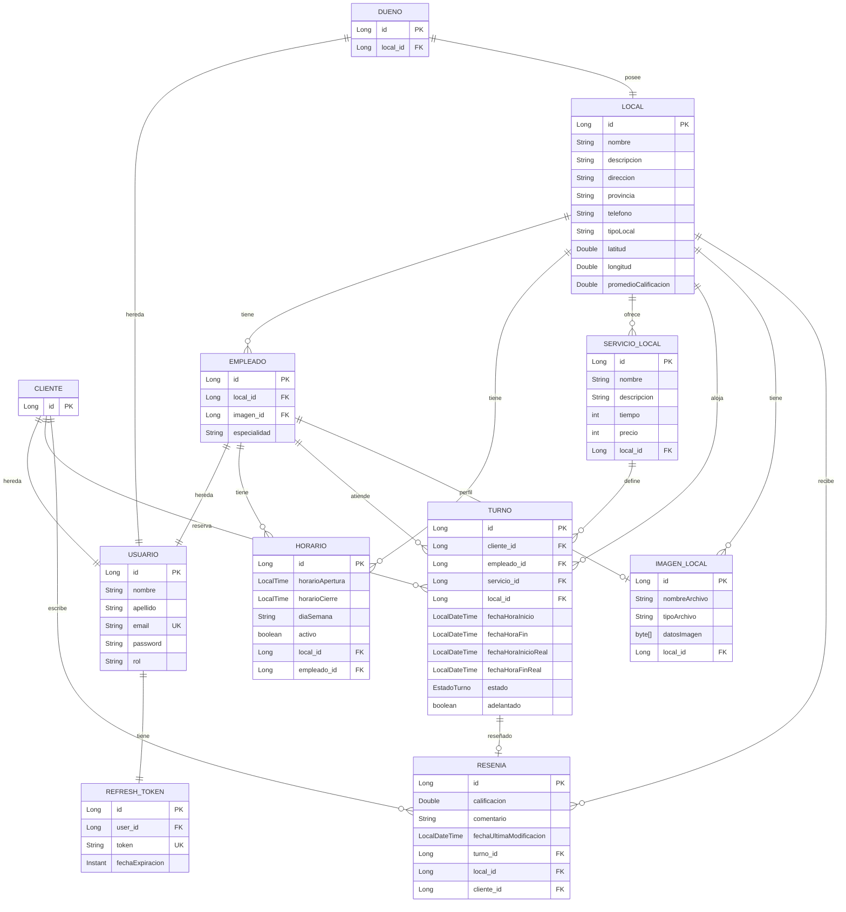

<p align="center">
  <h1 align="center">💈 TuTurno — Sistema de Gestión de Turnos</h1>
  <p align="center">
    <strong>API RESTful para la gestión de turnos en negocios de servicios</strong>
  </p>
</p>

<p align="center">
  
  
  
  
  
  
  
</p>

---

## 📋 Tabla de Contenidos

- [Descripción General](#-descripción-general)
- [Stack Técnico](#-stack-técnico)
- [Características Principales](#-características-principales)
- [Arquitectura](#-arquitectura)
- [Modelo de Datos](#-modelo-de-datos)
- [Documentación de la API](#-documentación-de-la-api)
- [Instalación y Configuración](#-instalación-y-configuración)
- [Variables de Entorno](#-variables-de-entorno)
- [Ejecución del Proyecto](#-ejecución-del-proyecto)
- [Estructura del Proyecto](#-estructura-del-proyecto)
- [Autor](#-autor)

---

## 🎯 Descripción General

**TuTurno** es un sistema backend diseñado para resolver el desafío operativo central que enfrentan los negocios basados en servicios (peluquerías, barberías, spas, etc.): **la gestión eficiente de turnos y reservas**.

La plataforma habilita un ecosistema multi-rol donde:

- **Dueños** crean y administran su local, definen servicios, registran empleados, configuran horarios y suben imágenes del negocio.
- **Empleados** gestionan sus horarios personales, confirman/cancelan turnos, registran atenciones sin reserva previa y consultan sus ganancias.
- **Clientes** exploran locales disponibles mediante búsqueda paginada con filtros, consultan disponibilidad en tiempo real, reservan turnos, dejan reseñas y gestionan su perfil.

El sistema automatiza las transiciones del ciclo de vida de los turnos, envía recordatorios por email mediante tareas programadas y aplica control de acceso estricto basado en roles.

---

## 🛠 Stack Técnico

| Categoría | Tecnología | Versión |
|---|---|---|
| **Lenguaje** | Java (OpenJDK) | 21 |
| **Framework** | Spring Boot | 3.5.9 |
| **Persistencia** | Spring Data JPA / Hibernate | — |
| **Base de Datos** | PostgreSQL | Runtime |
| **Seguridad** | Spring Security + JWT (`jjwt`) | 0.11.5 |
| **Validación** | Jakarta Bean Validation | — |
| **Email** | Spring Boot Starter Mail | — |
| **Documentación API** | SpringDoc OpenAPI (Swagger UI) | 2.8.14 |
| **Herramienta de Build** | Apache Maven | Wrapper incluido |
| **Herramientas de Desarrollo** | Spring Boot DevTools (recarga en caliente) | — |

---

## ✨ Características Principales

### 🔐 Autenticación y Autorización
- Registro de usuarios con roles diferenciados: `CLIENTE`, `DUENO`, `EMPLEADO`
- Autenticación stateless mediante **JWT** almacenado en **Cookies HttpOnly** (access token + refresh token)
- Mecanismo de renovación de token sin necesidad de re-login
- Encriptación de contraseñas con **BCrypt**
- Protección de endpoints por roles mediante la cadena de filtros de Spring Security

### 🏢 Gestión del Local (Dueño)
- CRUD completo de información del local (nombre, descripción, dirección, provincia, teléfono, tipo, geolocalización)
- Gestión de galería de imágenes con almacenamiento binario (BYTEA), soporte para carga masiva y edición parcial
- Cálculo de calificación promedio derivada de las reseñas de clientes

### 👥 Gestión de Empleados (Dueño)
- CRUD con carga de imagen de perfil (`multipart/form-data`)
- Asociación empleado-local con campo de especialidad
- Gestión de horarios individuales por empleado

### 🕐 Gestión de Horarios
- Doble alcance: horarios a nivel de **local** y a nivel de **empleado**
- Configuración por día de la semana (Lunes a Domingo)
- Horarios de apertura/cierre con toggle activo/inactivo
- Operaciones CRUD completas para cada alcance

### ✂️ Catálogo de Servicios
- CRUD de servicios ofrecidos (nombre, descripción, precio, duración en minutos)
- Asociación servicio-local garantizada a nivel de persistencia

### 📅 Motor de Reserva de Turnos
- **Cálculo de disponibilidad en tiempo real** mediante `CalculadoraDisponibilidadService`:
  - Cruza el horario del empleado con los turnos activos existentes
  - Genera slots de tiempo disponibles en intervalos de 15 minutos según la duración del servicio
  - Filtra slots pasados y reservas con solapamiento
- **Detección de solapamiento** mediante consultas JPQL para prevenir doble reserva
- **Validación de negocio**: verificación de consistencia empleado-servicio-local
- Los clientes están limitados a un turno activo a la vez
- Los empleados pueden crear registros de turnos sin reserva previa (cliente anónimo)

### 🔄 Ciclo de Vida del Turno
- Máquina de estados: `PENDIENTE` → `CONFIRMADO` → `FINALIZADO` / `CANCELADO`
- **Transiciones automáticas de estado** mediante tareas `@Scheduled` (cada 10 minutos)
- Tanto clientes como empleados pueden cancelar turnos
- Los empleados confirman turnos pendientes (dispara email de confirmación)

### 📧 Notificaciones por Email
- Envío de emails **asíncrono** (`@Async`)
- Email de confirmación enviado al aprobar un turno
- **Recordatorios diarios** a las 8:00 AM para los turnos confirmados del día
- Filtro de emails a clientes anónimos

### ⭐ Reseñas y Calificaciones
- Los clientes publican reseñas (calificación 0–5 + comentario) vinculadas al local y al turno
- Una única reseña por cliente por local (restricción `UNIQUE` a nivel de base de datos)
- Endpoints públicos para listar reseñas y obtener el promedio de calificación

### 📊 Estadísticas del Empleado
- Cálculo de ingresos por rango de fechas basado en turnos finalizados

### 🔍 Descubrimiento Público
- Búsqueda paginada de locales con filtros opcionales: tipo, provincia, nombre
- Acceso público a detalles del local, imágenes y reseñas (sin autenticación)

### 🛡️ Manejo de Errores
- Manejo centralizado de excepciones mediante `@RestControllerAdvice`
- Excepciones personalizadas: `EmailExistenteException`, `CredencialesInvalidasException`
- Respuestas de error en JSON estructurado con códigos HTTP apropiados

---

## 🏛 Arquitectura

El proyecto sigue un patrón de **Arquitectura en Capas (N-Tier)** con separación clara de responsabilidades:

```
┌──────────────────────────────────────────────────────────┐
│                    CLIENTE (Frontend)                     │
└──────────────────────┬───────────────────────────────────┘
                       │ HTTP (REST + Cookies)
┌──────────────────────▼───────────────────────────────────┐
│             🔒 Cadena de Filtros de Seguridad            │
│        JwtAuthenticationFilter → UserPrincipal           │
└──────────────────────┬───────────────────────────────────┘
                       │
┌──────────────────────▼───────────────────────────────────┐
│              📡 Controladores (API REST)                 │
│ AuthController · TurnoClienteController · LocalCtrl...   │
│                 ↕ DTOs para transferencia                │
└──────────────────────┬───────────────────────────────────┘
                       │
┌──────────────────────▼───────────────────────────────────┐
│             ⚙️ Servicios (Lógica de Negocio)            │
│ TurnoServiceImp · CalculadoraDisponibilidadService       │
│ AuthService · EmailServiceImp · TurnoTareaScheduler      │
└──────────────────────┬───────────────────────────────────┘
                       │
┌──────────────────────▼───────────────────────────────────┐
│            💾 Repositorios (Acceso a Datos)              │
│      Spring Data JPA + Consultas JPQL Personalizadas     │
└──────────────────────┬───────────────────────────────────┘
                       │
┌──────────────────────▼───────────────────────────────────┐
│                🗄️ Base de Datos PostgreSQL               │
└──────────────────────────────────────────────────────────┘
```

**Flujo de datos:** Cliente → Filtro de Seguridad → Controlador → Servicio → Repositorio → Base de Datos

**Aspectos transversales:**
- **Validación:** Anotaciones de Jakarta Bean Validation en entidades y DTOs
- **Manejo de excepciones:** `GlobalExceptionHandler` con `@RestControllerAdvice`
- **Tareas programadas:** `TurnoTareaScheduler` para transiciones automáticas de estado y envío de recordatorios
- **Procesamiento asíncrono:** `@Async` para envío de emails no bloqueante

---

## 📊 Modelo de Datos

### Diagrama Entidad-Relación



### Estrategia de Herencia
La entidad `Usuario` utiliza **herencia JPA con tablas separadas (Joined Table)** (`@Inheritance(strategy = InheritanceType.JOINED)`), creando tablas independientes para `Cliente`, `Dueno` y `Empleado` que se unen con la tabla `usuario`.

### Estados del Turno

| Estado | Descripción |
|---|---|
| `PENDIENTE` | Reservado por el cliente, pendiente de confirmación del empleado |
| `CONFIRMADO` | Confirmado por el empleado — dispara email de confirmación |
| `EN_CURSO` | El turno está en progreso |
| `FINALIZADO` | Se establece automáticamente cuando pasa la hora de fin (tarea programada) |
| `CANCELADO` | Cancelado por el cliente o el empleado |

---

## 📡 Documentación de la API

> 📖 **Documentación interactiva disponible en** `http://localhost:8080/swagger-ui.html` cuando el servidor está en ejecución.

### 🔓 Autenticación (`/autenticacion`)

| Método | Endpoint | Descripción | Auth |
|---|---|---|---|
| `POST` | `/autenticacion/cliente` | Registrar un nuevo cliente | 🌐 Público |
| `POST` | `/autenticacion/dueno` | Registrar un nuevo dueño de negocio | 🌐 Público |
| `POST` | `/autenticacion/login` | Iniciar sesión — establece cookies HttpOnly | 🌐 Público |
| `POST` | `/autenticacion/refresh` | Renovar token de acceso mediante cookie | 🔑 Cookie |

### 🌐 Público (`/publico`)

| Método | Endpoint | Descripción | Auth |
|---|---|---|---|
| `GET` | `/publico/locales` | Buscar locales (paginado, con filtros) | 🌐 Público |
| `GET` | `/publico/locales/{id}` | Obtener detalle del local por ID | 🌐 Público |
| `GET` | `/publico/locales/imagenes/{id}` | Descargar imagen del local (binario) | 🌐 Público |
| `GET` | `/publico/locales/{localId}/resenias` | Listar reseñas de un local | 🌐 Público |
| `GET` | `/publico/locales/{localId}/resenias/promedio` | Obtener calificación promedio | 🌐 Público |

### 👤 Cliente (`/cliente`)

| Método | Endpoint | Descripción | Auth |
|---|---|---|---|
| `GET` | `/cliente/perfil` | Obtener perfil del cliente actual | 🔐 CLIENTE |
| `PUT` | `/cliente/perfil` | Actualizar perfil del cliente | 🔐 CLIENTE |
| `DELETE` | `/cliente/perfil` | Eliminar cuenta del cliente | 🔐 CLIENTE |
| `POST` | `/cliente/turnos` | Reservar un turno | 🔐 CLIENTE |
| `GET` | `/cliente/turnos/disponibilidad` | Consultar disponibilidad de slots | 🌐 Público |
| `GET` | `/cliente/turnos/activos` | Listar turnos activos | 🔐 CLIENTE |
| `GET` | `/cliente/turnos/historial` | Historial de turnos | 🔐 CLIENTE |
| `PATCH` | `/cliente/turnos/{turnoId}/cancelar` | Cancelar un turno | 🔐 CLIENTE |
| `POST` | `/cliente/resenias` | Publicar una reseña | 🔐 CLIENTE |

### 🏢 Dueño del Negocio (`/dueno`)

| Método | Endpoint | Descripción | Auth |
|---|---|---|---|
| `POST` | `/dueno/local` | Crear local | 🔐 DUENO |
| `GET` | `/dueno/local` | Obtener local propio | 🔐 DUENO |
| `PUT` | `/dueno/local` | Actualizar local | 🔐 DUENO |
| `GET` | `/dueno/local/{id}` | Obtener local por ID | 🔐 DUENO |
| `POST` | `/dueno/empleados` | Crear empleado (multipart) | 🔐 DUENO |
| `GET` | `/dueno/empleados` | Listar empleados | 🔐 DUENO |
| `GET` | `/dueno/empleados/{id}` | Obtener empleado por ID | 🔐 DUENO |
| `PUT` | `/dueno/empleados/{id}` | Actualizar empleado (multipart) | 🔐 DUENO |
| `DELETE` | `/dueno/empleados/{id}` | Eliminar empleado | 🔐 DUENO |
| `POST` | `/dueno/servicios` | Crear servicio | 🔐 DUENO |
| `GET` | `/dueno/servicios` | Listar servicios | 🔐 DUENO |
| `GET` | `/dueno/servicios/{id}` | Obtener servicio por ID | 🔐 DUENO |
| `PUT` | `/dueno/servicios/{id}` | Actualizar servicio | 🔐 DUENO |
| `DELETE` | `/dueno/servicios/{id}` | Eliminar servicio | 🔐 DUENO |
| `POST` | `/dueno/horarios` | Crear horario del local | 🔐 DUENO |
| `GET` | `/dueno/horarios` | Listar horarios del local | 🔐 DUENO |
| `GET` | `/dueno/horarios/{id}` | Obtener horario por ID | 🔐 DUENO |
| `PUT` | `/dueno/horarios/{id}` | Actualizar horario del local | 🔐 DUENO |
| `DELETE` | `/dueno/horarios/{id}` | Eliminar horario del local | 🔐 DUENO |
| `POST` | `/dueno/local/imagenes` | Subir imágenes del local (multipart) | 🔐 DUENO |
| `GET` | `/dueno/local/imagenes` | Listar imágenes del local | 🔐 DUENO |
| `PATCH` | `/dueno/local/imagenes` | Edición parcial (agregar/eliminar imágenes) | 🔐 DUENO |
| `GET` | `/dueno/local/imagenes/{id}/archivo` | Descargar archivo de imagen | 🌐 Público |

### 👨‍💼 Empleado (`/empleado`)

| Método | Endpoint | Descripción | Auth |
|---|---|---|---|
| `POST` | `/empleado/agenda` | Crear turno sin reserva previa (walk-in) | 🔐 EMPLEADO |
| `GET` | `/empleado/agenda/disponibilidad` | Consultar disponibilidad propia | 🔐 EMPLEADO |
| `GET` | `/empleado/agenda/mis-servicios` | Listar servicios disponibles | 🔐 EMPLEADO |
| `GET` | `/empleado/turnos/confirmados` | Listar turnos confirmados | 🔐 EMPLEADO |
| `GET` | `/empleado/turnos/pendientes` | Listar turnos pendientes | 🔐 EMPLEADO |
| `GET` | `/empleado/turnos/historial` | Historial de turnos | 🔐 EMPLEADO |
| `PATCH` | `/empleado/turnos/{id}/confirmar` | Confirmar turno → envía email | 🔐 EMPLEADO |
| `PATCH` | `/empleado/turnos/{id}/cancelar` | Cancelar turno | 🔐 EMPLEADO |
| `POST` | `/empleado/horarios` | Crear horario propio | 🔐 EMPLEADO |
| `GET` | `/empleado/horarios` | Listar horarios propios | 🔐 EMPLEADO |
| `GET` | `/empleado/horarios/{id}` | Obtener horario por ID | 🔐 EMPLEADO |
| `PUT` | `/empleado/horarios/{id}` | Actualizar horario propio | 🔐 EMPLEADO |
| `DELETE` | `/empleado/horarios/{id}` | Eliminar horario propio | 🔐 EMPLEADO |
| `GET` | `/empleado/estadisticas/ganancias` | Ingresos por rango de fechas | 🔐 EMPLEADO |

---

## 🚀 Instalación y Configuración

### Requisitos Previos

- **Java 21** (JDK)
- **PostgreSQL** 14+ (instancia en ejecución)
- **Maven 3.8+** (o utilizar el wrapper `mvnw` incluido)
- **Credenciales SMTP** (se recomienda Contraseña de Aplicación de Gmail para las funcionalidades de email)

### 1. Clonar el Repositorio

```bash
git clone https://github.com/<tu-usuario>/sistematunos-back.git
cd sistematunos-back
```

### 2. Configurar la Base de Datos

Crear una base de datos en PostgreSQL:

```sql
CREATE DATABASE tuturno_db;
```

### 3. Configurar `application.properties`

Crear o actualizar el archivo `src/main/resources/application.properties`:

```properties
# ── Servidor ────────────────────────────────────────────
server.port=8080

# ── Base de Datos ───────────────────────────────────────
spring.datasource.url=jdbc:postgresql://localhost:5432/tuturno_db
spring.datasource.username=tu_usuario_db
spring.datasource.password=tu_contraseña_db

# ── JPA / Hibernate ────────────────────────────────────
spring.jpa.hibernate.ddl-auto=update
spring.jpa.show-sql=true
spring.jpa.properties.hibernate.dialect=org.hibernate.dialect.PostgreSQLDialect

# ── JWT ─────────────────────────────────────────────────
jwt.secret=tu_clave_secreta_en_base64_minimo_256_bits
jwt.expiration=900000

# ── Refresh Token ───────────────────────────────────────
refresh.token.duration=604800000

# ── Email (SMTP) ────────────────────────────────────────
spring.mail.host=smtp.gmail.com
spring.mail.port=587
spring.mail.username=tu_email@gmail.com
spring.mail.password=tu_contraseña_de_aplicacion
spring.mail.properties.mail.smtp.auth=true
spring.mail.properties.mail.smtp.starttls.enable=true

# ── Subida de Archivos ─────────────────────────────────
spring.servlet.multipart.max-file-size=5MB
spring.servlet.multipart.max-request-size=20MB
```

> ⚠️ **Importante:** El archivo `application.properties` está listado en `.gitignore`. **Nunca subas credenciales al control de versiones.**

---

## ▶️ Ejecución del Proyecto

### Usando Maven Wrapper (recomendado)

```bash
# Linux / macOS
./mvnw spring-boot:run

# Windows
mvnw.cmd spring-boot:run
```

### Usando Maven global

```bash
mvn spring-boot:run
```

### Generar un JAR ejecutable

```bash
./mvnw clean package -DskipTests
java -jar target/sistematunos-back-0.0.1-SNAPSHOT.jar
```

El servidor se iniciará en `http://localhost:8080`.

**Swagger UI:** [`http://localhost:8080/swagger-ui.html`](http://localhost:8080/swagger-ui.html)

---

## 📁 Estructura del Proyecto

```
sistematunos-back/
├── src/
│   ├── main/
│   │   ├── java/com/gaston/sistema/turno/sistematunos_back/
│   │   │   ├── SistematunosBackApplication.java     # Punto de entrada (@EnableScheduling, @EnableAsync)
│   │   │   ├── configuration/
│   │   │   │   └── OpenApiConfig.java               # Configuración de Swagger/OpenAPI
│   │   │   ├── controllers/                         # 14 controladores REST
│   │   │   │   ├── AuthController.java              # Registro e inicio de sesión
│   │   │   │   ├── TurnoClienteController.java      # Operaciones de turnos del cliente
│   │   │   │   ├── TurnoGestionEmpleadoController.java  # Gestión de turnos del empleado
│   │   │   │   ├── AgendaEmpleadoController.java    # Agenda y walk-ins del empleado
│   │   │   │   ├── LocalController.java             # CRUD del local (dueño)
│   │   │   │   ├── EmpleadoController.java          # CRUD de empleados (dueño)
│   │   │   │   ├── ServicioLocalController.java     # CRUD de servicios (dueño)
│   │   │   │   ├── HorarioLocalController.java      # Horarios del local (dueño)
│   │   │   │   ├── HorarioEmpleadoController.java   # Horarios del empleado
│   │   │   │   ├── ImagenLocalController.java       # Gestión de imágenes (dueño)
│   │   │   │   ├── PublicoLocalController.java      # Descubrimiento público de locales
│   │   │   │   ├── ClienteController.java           # Perfil del cliente
│   │   │   │   ├── ReseniaController.java           # Reseñas
│   │   │   │   └── EstadisticaEmpleadoController.java  # Estadísticas del empleado
│   │   │   ├── dto/                                 # 15 Objetos de Transferencia de Datos
│   │   │   ├── entities/                            # 13 Entidades JPA + Enums
│   │   │   ├── repositories/                        # 11 Repositorios de Spring Data
│   │   │   ├── security/                            # Filtro JWT, configuración, UserPrincipal
│   │   │   ├── services/                            # 26 archivos de servicio (interfaces + impl)
│   │   │   └── validation/                          # Excepciones personalizadas + GlobalExceptionHandler
│   │   └── resources/
│   │       └── application.properties               # Configuración (en .gitignore)
│   └── test/                                        # Tests unitarios
├── pom.xml                                          # Dependencias Maven
├── mvnw / mvnw.cmd                                  # Maven Wrapper
└── README.md
```

---

## 👤 Autor

**Gastón Olartes**

---

<p align="center">
  <sub>Construido con ☕ Java y Spring Boot</sub>
</p>
